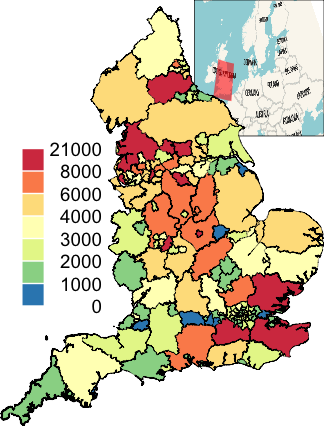
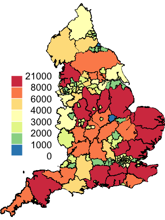
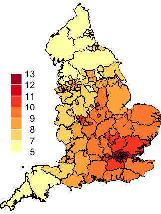
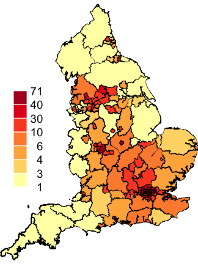
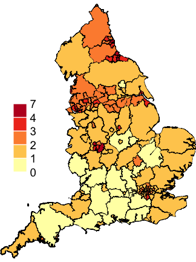
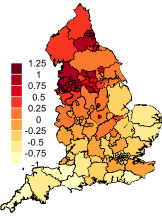
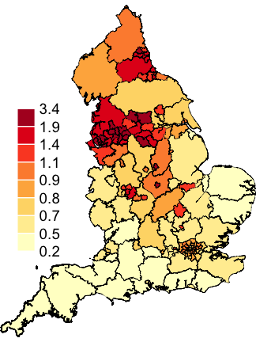

# Introduction
The World Health Organization estimates that ambient air pollution accounts for 4.2 million deaths per year due to stroke, heart disease, lung cancer and chronic respiratory diseases.$^{[1]}$ As the novel coronavirus (SARS-CoV-2) is a disease of the respiratory system, emerging research finds that exposure to fine particles (PM$_{2.5}$; particles with diameter $\leq 2.5 \mu m$) increases mortality risk, exacerbates the severity of COVID-19 symptoms and may worsen the prognosis.$^{[2]}$ Higher death rates are commonly observed among the lower income and ethnic minority groups due to the existing health and economic inequalities that contribute to, and result from, greater exposure to air pollution.$^{[3]}$ This report aims to investigate the effects of exposure to ambient air pollution on the COVID-19 incidence rate in England, accounting for the potential confounders of unemployment rate and ethnic minority population. 

# Methods
The data is provided on the STA442 course webpage which contains COVID-19 cases up to 15 October 2020. The data is a `SpatialPolygonsDataFrame` object containing information on the boundaries of the public health regions in England and the variables of interest. 

A parameterized Besag York Mollié (BYM) model was fit to the count response of COVID-19 cases for the areal data of different public health regions in England. An exploratory analysis in Figure 2 reveals that regions with higher population density is expected to have higher numbers of cases. This existing spatial variation can be accounted for by an offset term of the population and known incidence rate. The BYM model was used as it contains both an Intrinsic Conditional AutoRegressive (ICAR) component for spatial smoothing and an ordinary random-effects component for nonspatial heterogeneity. The ICAR component captures the correlation of the areal data with its neighbouring regions which we assumed to exist as the underlying spatial structure. Its parameterization allows for the spatially structured component to be seen independently from the unstructured component which enables our sensible prior fits on the random effects.$^{[4]}$. The spatial model was implemented in the INLA software $^{[5]}$ using the `diseasemapping` package $^{[6]}$ in R. The INLA, or Integrated Nested Laplace Approximation is a computationally efficient method for Bayesian inference.

## Model
$$Y_i \sim Poisson(E_i \lambda_i)$$
$$log(\lambda_i) = \mu + X^T_i \beta + U_i$$
$$U_i \sim BYM(\sigma, \phi)$$
$$U_i = W_i + V_i$$
$$V_i \stackrel{iid} \sim N(0, \tau^2)$$
$$W_i | \{W_j; j \neq i\} \sim N(mean\{W_j; j \sim i\},  \frac{c \xi}{|j \sim i|})$$
$$\sigma = \sqrt{\tau^2 + \xi^2}$$
$$\phi = \frac{\xi}{\sigma}$$

$$\beta \stackrel{iid} \sim N(0, 10^2)$$
$$\sigma^2 \sim \text{Exponential prior such that } Pr(\sigma > 0.5) = 0.5$$
$$\phi \sim \text{Exponential prior such that } Pr(\phi > 0.5) = 0.5$$

- i = 1,..., 149 public health regions in England

- $|j \sim i|$: neighbour j sharing a common border to region i

- $Y_i$: COVID-19 case count for region i

- $E_i$: offset term by expected number of COVID-19 cases

- $\lambda_i$: relative risk for region i

- $U_i$: spatial random effect; sum of a spatially independent process and a spatial process with conditional dependence between neighbours

- $\sigma$: standard deviation parameter; overall standard deviation

- $\phi$: spatial dependence parameter; spatial proportion

- $W_i$: spatial Intrinsic Conditionally Autoregressive Model (ICAR)

- $V_i$: independent noise

- c: constant chosen such that $\xi \approx var(W_i)$

## Prior Specification 
A default weakly informative zero-mean Gaussian prior was assigned to the regression parameters $\beta$. The penalized complexity prior is an exponential of the square root of the Kullback-Leibler distance which gives preference to less complex models unless the data informs otherwise.$^[7]$ The prior of $\sigma$ such that $Pr(\sigma > 0.5) = 0.5$ encodes our belief that the probability of the total spatial standard deviation is greater than 50% is the prior median.  This specification encourages small values for $\sigma$ which corresponds to a flat $U_i$ surface suggesting that all covariates are expected to be correctly identified and measured by the model. The prior of  $\phi$ such that $Pr(\phi > 0.5) = 0.5$ encodes our belief that the probability that the spatial proportion is greater than 50% is the prior median. This specification encourages a flat distribution for $\phi$ suggesting that $U_i$ is independent and regions are unrelated to its neighbours. The parameterized BYM is rather sensitive to prior choices and is less informed by the data. However, these prior specifications are reasonably sensible and achieves its ultimate purpose of discouraging the most extreme values as shown in the prior-posterior distributions in Figure 4.


# Results
```{r include=FALSE}
#load library
library("sp")
library("diseasemapping")
library("geostatsp")
library("knitr")
library("kableExtra")
library("bookdown")
library('INLA')


#load data
(load("England_shp.RData"))
(load("englandRes.RData"))


#fit INLA
UK_shp$logExpected = log(UK_shp$E)
# remove an island
UK2 = UK_shp[grep("Wight", UK_shp$Name, invert = TRUE),
]
englandRes = diseasemapping::bym(cases ~ offset(logExpected) +
Ethnicity + modelledpm25 + Unemployment, prior = list(sd = c(0.5,
0.5), propSpatial = c(0.5, 0.5)), family = "poisson",
data = UK2)

```

```{r echo=FALSE}
#risk ratio
risk_ratio = exp(englandRes$parameters$summary)[, paste0(c(0.5,
0.025, 0.975), "quant")]

knitr::kable(risk_ratio, digits=2, caption = "Posterior Medians and 95% Credible Interval for Incidence Rate and Spatial Random Effects Parameters", format = "pandoc")
```

```{r random_effects, out.width=".5\\linewidth", fig.cap="Prior and Posterior", fig.subcap= c("standard deviation", "Spatial Dependence"), nrow=1, echo=FALSE}

#prior and posterior plots

{plot(englandRes$parameters$sd$posterior,type='l', xlim=c(0.2,0.5),xlab='sd', ylab='density')
lines(englandRes$parameters$sd$prior,col='red')
legend("topright", lty=1,col=c('black','red'),
legend=c('posterior','prior'), bty='n')
}


{plot(englandRes$parameters$propSpatial$posterior, type='l', xlim=c(0.7, 1.05), xlab='prop spatial', ylab='density')
lines(englandRes$parameters$propSpatial$prior, col='red')
legend("topright", lty=1, col=c('black', 'red'), legend=c('posterior', 'prior'), bty='n')
}
```

```{r results1, out.width=".3\\linewidth", fig.align="center", fig.cap="COVID 19 Cases in England", fig.subcap= c("Cases", "Expected Number of Cases"), nrow=1, echo=FALSE, fig.show='hold'}

#insert the plots



```


```{r results2, out.width=".3\\linewidth", fig.align="center", fig.cap="BYM Model Results", fig.subcap= c("PM2.5", "Ethnicity", "Unemployment"), nrow=1, echo=FALSE,  fig.fullwidth=TRUE, fig.show='hold'}

#insert the plots



```


```{r results3, out.width=".3\\linewidth", fig.align="center", fig.cap="BYM Model Results", fig.subcap= c("Random Effect", "Incidence Rate"), nrow=1, echo=FALSE, fig.show='hold'}



```

```{r excprob, fig.align="center", fig.cap="Exceedance Probabilities", fig.subcap= c("Incidence Rate. Pr($\\lambda$(s) > 1.1|Y)", "Random Effect. Pr(U(s) > log(1.01)|Y)"), echo=FALSE, fig.show='hold', warning=FALSE, message=FALSE, fig.width=5, fig.asp=1,out.width=".6\\linewidth"}

englandRes$data$excProb = excProb(englandRes$inla$marginals.fitted.bym, log(1.1))

englandRes$data$excProbU = excProb(englandRes$inla$marginals.bym, log(1.01))

excProbCol = mapmisc::colourScale(englandRes$data$excProb, breaks=12, style="equal", dec=-log10(.25))
excProbUCol = mapmisc::colourScale(englandRes$data$excProbU, breaks=12, style="equal", dec=-log10(.25))


{mapmisc::map.new(UK2)
plot(UK2, col=excProbCol$plot, add=TRUE, lwd=0.2)
mapmisc::legendBreaks("left", excProbCol, bty="n")
}

{mapmisc::map.new(UK2)
plot(UK2, col=excProbUCol$plot, add=TRUE, lwd=0.2)
mapmisc::legendBreaks("left", excProbUCol, bty="n")
}


```

# Discussion
For a 1% increase in ethnic minority population of a public health region in England, the incidence rate of COVID-19 cases increases by 1% with a narrow 95% credible interval of (1.01, 1.02). For a 1% increase in the concentration of PM$_{2.5}$, the incidence rate increases by 6% with a relatively narrow 95% CI (1.00, 1.12). For a 1% increase in unemployment, the incidence rate increases by 12% with a narrow 95% CI of (1.06, 1.18). These estimates are in agreement with the literature $^{[3]}$ as exposure to air pollution does increase the incidence rate of COVID-19 especially among the lower income and ethnic minority population. As all parameter estimates are within quite a narrow credible interval, this suggests a statistically significant difference. Furthermore, the posterior median of $\sigma$ = 1.34 (95% CI: 1.30, 1.40) and $\phi$ = 2.48 (95%CI: 2.16, 2.65) are also estimated with high certainty. The relatively small value of $\sigma$ indicates that the covariates are well identified in the model. The posterior for $\phi$ has little mass near zero, justifying the spatial random effect in the model and a dependence of region i to its neighbours j after accounting for the known covariates. The map of the random effect in Figure 3 suggests that these covariates explain the response fairly well near the south of England, however there appears to be other significant factors contributing to the rest of England, particularly in the North. Most of the COVID-19 cases are reported with relatively high certainty with only two distinct clusters of a 10% probability of excess incidence rate in the Northern regions. The probability that the random effect is above 1% is most prominent in the Northern regions and less common in the Southern regions.

# Conclusion
The incidence rate of COVID-19 cases for public health regions in England increases with an increase in the concentration of PM$_{2.5}$ and with evidence of a statistically significant difference among lower income and ethnic minority populations. Thus, it is recommended that policy makers take income and ethnic minority factors into consideration in public health planning as to avoid threatening the already vulnerable populations. 

# References
[1] Air pollution. (n.d.). Retrieved December 10, 2020, from https://www.who.int/health-topics/air-pollution

[2] Wu, X., Nethery, R. C., Sabath, M. B., Braun, D., &amp; Dominici, F. (2020). Air pollution and COVID-19 mortality in the United States: Strengths and limitations of an ecological regression analysis. Science Advances, 6(45). doi:10.1126/sciadv.abd4049

[3] Coronavirus and Air Pollution. (2020, November 10). Retrieved December 13, 2020, from https://www.hsph.harvard.edu/c-change/subtopics/coronavirus-and-pollution/

[4] Riebler, A., Sørbye, S. H., Simpson, D., &amp; Rue, H. (2016). An intuitive Bayesian spatial model for disease mapping that accounts for scaling. Statistical Methods in Medical Research, 25(4), 1145-1165. doi:10.1177/0962280216660421

[5] Bayesian computing. (2015). Spatial and Spatio-temporal Bayesian Models with R-INLA, 75-126. doi:10.1002/9781118950203.ch4

[6] Patrick Brown, Lutong Zhou (2020). diseasemapping: Modelling Spatial Variation in Disease Risk for Areal Data. R package version 1.4.9. https://cran.r-project.org/package=diseasemapping

[7] Simpson, Daniel, Haavard Rue, Andrea Riebler, Thiago G. Martins, and Sigrunn H. Sorbye (Feb. 2017). “Penalising Model Component Complexity: A Principled, Practical Approach to Constructing Priors”. In: Statistical Science 32.1, pp. 1–28. doi: 10.1214/16-STS576

# Appendix
```{r eval=FALSE, fig.show='hold'}
#load library
library("diseasemapping")
library("sp")
library("raster")
library("kableExtra")
library('INLA', verbose=FALSE)
library('knitr')
library('bookdown')

#load data
(load("England_shp.RData"))

#fit INLA
UK_shp$logExpected = log(UK_shp$E)
# remove an island
UK2 = UK_shp[grep("Wight", UK_shp$Name, invert = TRUE),
]
englandRes = diseasemapping::bym(cases ~ offset(logExpected) +
Ethnicity + modelledpm25 + Unemployment, prior = list(sd = c(0.5,
0.5), propSpatial = c(0.5, 0.5)), family = "poisson",
data = UK2)

#save the model
save(englandRes, file = "../data/englandRes.RData")

#risk ratio
risk_ratio = exp(englandRes$parameters$summary)[, paste0(c(0.5,
0.025, 0.975), "quant")]
#scale by IQR
IQREthnicity = (exp(diff(quantile(UK2$Ethnicity, probs=c(0.25, 0.75)))*englandRes$parameters$summary["Ethnicity", c(4,3,5)]) - 1)
risk_ratio[2,] = IQREthnicity

IQRmodelledpm25 = (exp(diff(quantile(UK2$modelledpm25, probs=c(0.25, 0.75)))*englandRes$parameters$summary["modelledpm25", c(4,3,5)]) - 1)
risk_ratio[3,] = IQRmodelledpm25

IQRUnemployment = (exp(diff(quantile(UK2$Unemployment, probs=c(0.25, 0.75)))*englandRes$parameters$summary["Unemployment", c(4,3,5)]) - 1)
risk_ratio[4,] = IQRUnemployment

knitr::kable(risk_ratio, digits=2, caption = "Scaled IQR Posterior Medians and 95% Credible Interval for Incidence Rate and Spatial Random Effects Parameters", format="pandoc")

#prior and posterior plots
{plot(englandRes$parameters$sd$posterior,type='l', xlim=c(0.2,0.5),xlab='sd', ylab='density')
lines(englandRes$parameters$sd$prior,col='red')
legend("topright", lty=1,col=c('black','red'),
legend=c('posterior','prior'), bty='n')
}


{plot(englandRes$parameters$propSpatial$posterior, type='l', xlim=c(0.7, 1.05), xlab='prop spatial', ylab='density')
lines(englandRes$parameters$propSpatial$prior, col='red')
legend("topright", lty=1, col=c('black', 'red'), legend=c('posterior', 'prior'), bty='n')
}


#maps
casesCol = mapmisc::colourScale(UK2$cases, dec = -3, breaks = 12,
col = "Spectral", style = "quantile", rev = TRUE)
Ecol = mapmisc::colourScale(UK2$E, breaks = casesCol$breaks,
col = casesCol$col, style = "fixed")
pmCol = mapmisc::colourScale(UK2$modelledpm25, breaks = 9,
dec = 0, style = "quantile")
ethCol = mapmisc::colourScale(UK2$Ethnicity, breaks = 9,
digits = 1, style = "quantile")
uCol = mapmisc::colourScale(UK2$Unemployment, breaks = 12,
dec = 0, style = "quantile")
rCol = mapmisc::colourScale(englandRes$data$random.mean,
breaks = 12, dec = -log10(0.25), style = "quantile")
fCol = mapmisc::colourScale(englandRes$data$fitted.exp,
breaks = 9, dec = 1, style = "quantile")
insetEngland1 = mapmisc::openmap(UK2, zoom = 3, fact = 4,
path = "waze", crs = CRS("+init=epsg:3035"))
insetEngland = raster::crop(insetEngland1, extend(extent(insetEngland1),
-c(25, 7, 4, 9.5) * 100 * 1000))
mapmisc::map.new(UK2)
mapmisc::insetMap(UK_shp, "topright", insetEngland, width = 0.4)
plot(UK2, col = casesCol$plot, add = TRUE, lwd = 0.2)
mapmisc::legendBreaks("left", casesCol, bty = "n")
mapmisc::map.new(UK2)
plot(UK2, col = Ecol$plot, add = TRUE, lwd = 0.2)
mapmisc::legendBreaks("left", casesCol, bty = "n")
mapmisc::map.new(UK2)
plot(UK2, col = pmCol$plot, add = TRUE, lwd = 0.2)
mapmisc::legendBreaks("left", pmCol, bty = "n")
mapmisc::map.new(UK2)
plot(UK2, col = ethCol$plot, add = TRUE, lwd = 0.2)
mapmisc::legendBreaks("left", ethCol, bty = "n")
mapmisc::map.new(UK2)
plot(UK2, col = uCol$plot, add = TRUE, lwd = 0.2)
mapmisc::legendBreaks("left", uCol, bty = "n")
mapmisc::map.new(UK2)
plot(UK2, col = rCol$plot, add = TRUE, lwd = 0.2)
mapmisc::legendBreaks("left", rCol, bty = "n")
mapmisc::map.new(UK2)
plot(UK2, col = fCol$plot, add = TRUE, lwd = 0.2)
mapmisc::legendBreaks("left", fCol, bty = "n")

```
 